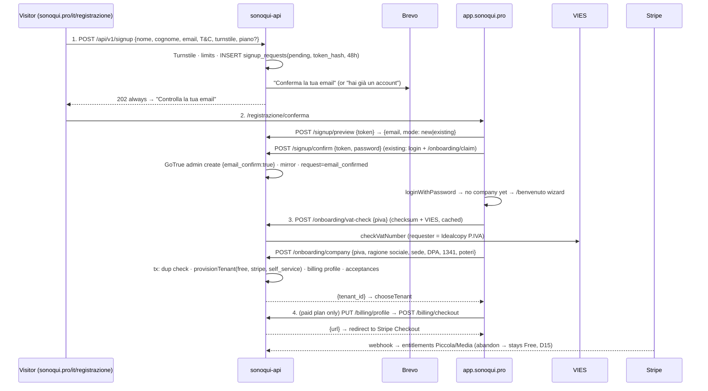

# Self-service onboarding + Stripe billing

- **Status:** Implemented 2026-09-18 on branch `feat/self-service-billing` (not yet merged or deployed). Phases 0–5 are built against the Stripe **sandbox**. The feature ships dark behind `SIGNUP_ENABLED` / `BILLING_ENABLED`, and the switch-on checklist is in `DEPLOY.md` (migration 067). Still open before go-live: Idealcopy's legal data, the lawyer's review of T&C/privacy/DPA, and the live Stripe account (§10).
- **Author:** product + Claude analysis session
- **Date:** 2026-09-18
- **Scope:** Free self-registration from the website, in the order registration → **email confirmation** → company P.IVA (VIES) → payment when a paid plan is chosen. A free plan (3 users, 1 sede). An in-app upgrade to the paid tiers ("Passa a Premium" badge). In-app purchase of the Cantieri and API modules at €50/month each. Stripe for **payments only** (fiscal invoices are issued by hand by the seller, Idealcopy S.r.l.). Super-user management of self-registered companies in the partner console.

---

## 0. TL;DR

| | |
|---|---|
| **Flow** | **1. Registrazione** on `sonoqui.pro/it/registrazione`: name, email, T&C. **Nothing is created except a pending request.** → **2. Email confirmation** link, where the user chooses a password; only now does the account exist. → **3. Azienda** in the web app: P.IVA checked by checksum + VIES, prefill, DPA. The company is created on the **Free** plan. → **4. Piano**: Free goes straight in; Piccola/Media go through the billing data and then Stripe Checkout. An abandoned payment leaves the company on Free with a "completa l'attivazione" banner. |
| **Free plan** | Existing caps, no new enforcement code: `max_users=3` (admin included), `max_branches=1`, `max_admins=1`, `max_documentali=1`. The API's existing 409 `LIMIT_REACHED` becomes an upsell. |
| **Paid** | The tiers already published on the website: Piccola €24,99 / Media €39,99 per month (annual = 11 months). Enterprise stays "contattaci". Cantieri / API modules at €50/month + IVA each, bought from Impostazioni by any **self-service** company, free or paid. Partner-managed companies keep getting modules from their partner. |
| **Stripe** | Redirect-only Checkout + Customer Portal + webhook, the pattern already pinned in `BOILERPLATE_ARCHITECTURE.md §10.9`. **One subscription per item** (plan / each module), so there are no pro-rata amounts and each item can be cancelled on its own. IVA 22% is a manual tax rate. Every Stripe customer email and invoice surface is off. |
| **Invoices** | Stripe keeps its internal Invoice objects (subscriptions need them), but customers never see one. Every successful charge lands in a **"Pagamenti da fatturare" ledger** in the partner console with the customer's billing data. Idealcopy issues the fattura elettronica (one *fattura differita* per customer per month is supported) and marks the row as invoiced. |
| **Super-user** | Partner console: Origine / Piano / Abbonamento columns and a filter, a "Registrazioni" funnel page, a "Pagamenti" ledger with CSV export, a billing-mode switch (Stripe ↔ managed) and entitlement overrides. |
| **Mobile** | No purchase UI (App Store / Play rules). It reflects entitlements through `/me`. |
| **Effort** | About 19–21 dev-days in 6 phases. The free signup (Phases 1 + 4) can go live before billing. |
| **Go-live blockers** | Idealcopy's legal data (P.IVA, REA, PEC, capitale) on the website. T&C, privacy and DPA rewritten for online B2B sales and reviewed by a lawyer. Stripe live account activated **in Idealcopy's name**. |

---

## 1. Assessment — what exists today

### 1.1 Reusable as-is

| Area | Today | File |
|---|---|---|
| Tenant caps | `tenants.max_users/max_admins/max_branches/max_documentali`, enforced on every create path (web, XLSX import, public API) with 409 `LIMIT_REACHED` `{kind,current,limit}`. Users are counted as non-deleted memberships, admin included. | `routes/users.ts:42-62,404-425,1165-1178`, `routes/branches.ts:61-74`, `routes/public/{users,branches}.ts` |
| Module flags | `tenants.cantieri_enabled`, `tenants.api_enabled`. They reach every request through `fetchMembership` and `/me`. The API-key middleware re-checks `api_enabled` on every call, so switching it off takes effect immediately. | `middleware/auth.ts:69` (`fetchMembership`), `lib/api-keys.ts:141,179` |
| Provisioning | `provisionTenant()` creates the tenant, then `ensureAuthUser` (which **reuses an existing account by email**), then the admin membership, in one transaction on `adminPool`, and logs any orphaned GoTrue user. | `lib/provision-tenant.ts`, `lib/auth-users.ts:34` |
| GoTrue admin helpers | `createUserSilently` (unconfirmed), `createUserWithPassword` (confirmed; e2e only today), `updateUserMetadata`, `sendAccessEmail`. `GOTRUE_DISABLE_SIGNUP=true` stays: our backend creates every account. | `lib/gotrue-admin.ts:66,100,150,392`, `docker-compose.yml:137` |
| Public form pattern | Website "Contattaci" → same-origin `POST /api/v1/helpdesk` (Caddy path-route), Turnstile siteverify, 5/h/IP limiter. | `routes/helpdesk.ts`, `apps/website/src/components/Footer.astro:146-209`, `infra/caddy-sonoqui.snippet:189-199` |
| Web login | `loginWithPassword()` + `useSession.refresh()`/`chooseTenant()`. A login that resolves no company gets the enumeration-safe generic error. | `apps/web/src/pages/Login.tsx:22-50`, `store/session.ts:101-189` |
| DPA columns | `tenants.dpa_accepted_at/by/version` exist and are never written anywhere. | `migrations/002_core_entities.sql:20-22` |
| Pinned Stripe design | Redirect-only (no `@stripe/stripe-js`); `/settings/subscription`, `/checkout/success` (polls `/me`, 8 × 1500 ms), `/checkout/cancel`; webhook `POST /api/v1/webhooks/stripe` behind `express.raw` **before** the JSON parser; `STRIPE_*` env; a `setup-stripe-products.ts` script; `stripe` npm package. | `Specs/BOILERPLATE_ARCHITECTURE.md:118,163,216,370,1145-1153` |
| Scheduler | node-cron jobs wrapped in `safeRun`. New jobs are added in one place. | `services/scheduler-service.ts` |
| Partner console | Tenants with `created_by_partner = NULL` already show as "Piattaforma". Every platform admin can see them; partners never can (`loadOwnedTenant` → `TENANT_NOT_OWNED`). The super-user gate (`requireSuperAdmin`, email match) is used by exactly one route today (`DELETE /tenants/:id`). There is a module registry `apps/partner/src/lib/modules.ts`. | `routes/partnership.ts:173-213,354-386,738`, `middleware/partnership-auth.ts:114` |

### 1.2 Gaps

- **Website:** no free tier and no signup page. Every CTA ("Inizia ora" on Piccola/Media, header "Richiedi l'accesso", the module CTAs) scrolls to `#contact` (`Pricing.astro:167-170`, `Header.astro:26-28`, `Moduli.astro:152-159,308-315`). The copy says outright that there is no self-registration (`data/seo.ts:124,462-465,581,667-669`, `public/llms.txt:7,11`, T&C `termini-e-condizioni.astro:25`). Modules are "prezzo su richiesta" (`Moduli.astro:89-93,162,318`, `seo.ts:114,119,245`). The legal pages never mention subscriptions, auto-renewal, cancellation, Stripe, Brevo or Turnstile (`privacy-policy.astro:83-95`), and name no legal entity.
- **Web app:**
  - No plan concept. The brand block (`Layout.tsx:127-143`) is a flex row that anchors the tenant dropdown, so the badge needs its own row below it.
  - Settings is one stacked page with no tabs, inside a single `<form>` (`Settings.tsx:191`). Purchase dialogs must be portalled out of it.
  - The API section is hidden when the module is off, with no upsell (`Settings.tsx:270-278`).
  - Nothing refreshes `/me` after a server-side change, and `refresh()` flips `loading` (skeleton + remount).
  - The limit tooltip says "Limite raggiunto — contatta supporto" (`Users.tsx:508-515`). Non-documentali 409s show the raw English server message.
  - **There is no "logged in, no company yet" state**: such a login is treated as bad credentials. This is by design for suspended companies (enumeration safety) and must stay that way for them.
- **Backend:**
  - Nothing billing-related: no signup route, no VIES client, no P.IVA checksum (only `^\d{11}$` in `settings.ts:20-24`).
  - Every tenant route requires a membership (`authenticate` → 403 `NO_ACTIVE_TENANT`), so the company step needs a JWT-only "account" auth.
  - `express.json` is global (`app.ts:83`), so the webhook must be mounted before it. The global IP limiter (`app.ts:110-123`) would throttle Stripe webhook bursts.
- **DB defence-in-depth:** `tenants_self_update` (`002_core_entities.sql:78`) lets the `app` role UPDATE any column of the admin's own tenant row. Only the Zod whitelist in `PATCH /settings` stops an admin from raising `max_users` or setting `api_enabled`. Once caps are paid entitlements this needs a DB guard (§4). `GET /settings` returns `SELECT * FROM tenants` (`settings.ts:38,57`), so billing identifiers must not live on `tenants`.
- **Stripe sandbox** (`acct_1UGIMoDbaczI8pnX`, "Sandbox di SONOQUI", checked 2026-09-18): empty. No products, no webhook destinations, €0 volume, EUR balance, live account not activated.

### 1.3 Bugs found in passing

1. `Users.tsx:106-120` reads `details.max`, but the backend sends `details.limit`, so `{{max}}` renders empty. Fixed in Phase 2 with the limit-UX rework.
2. `partnership.ts:74` + `Tenants.tsx:969` allow `max_documentali = 0`, but the DB has `CHECK (max_documentali >= 1)`. Spun off as a separate task.
3. The shared `Tenant` type (`packages/shared/src/types/index.ts:25-39`) is stale: it lacks `max_documentali`, `cantieri_enabled`, `api_enabled` and `partita_iva`. Refresh it with `plan`.
4. The website contact form shows the backend's English errors to Italian visitors. The signup form must use localized error codes.

---

## 2. Decisions

### 2.1 Confirmed by product (2026-09-18)

| # | Decision |
|---|---|
| D0 | **Flow order: registration → email confirmation → P.IVA → payment (only for a paid plan).** Nothing (no account, no company) is created before the email is confirmed. |
| D1 | "Premium" = **the published tiers**: Piccola (10 users / 3 sedi) and Media (20 / 5), monthly or annual. Enterprise stays "contattaci". |
| D2 | **VIES soft + review.** A wrong P.IVA check digit is blocked. "Not found in VIES" is accepted, flagged `not_in_vies` and put in the super-user's review list (Italian VAT numbers only appear in VIES after an opt-in for EU trade, so many domestic micro-SMEs are absent). VIES unreachable: accept and re-check in the background. **Italian P.IVA only in v1.** |
| D3 | **Separate charge per item:** one Stripe subscription for the plan and one per module. Every purchase is a Checkout Session. No pro-rata amounts. Each item can be cancelled on its own. The ledger groups charges per customer per month for a single *fattura differita*. |
| D4 | Free plan = **3 users in total, admin included** (the admin plus 2 employees). Counting unchanged: every non-deleted membership, so deactivated users still count and the UI says "elimina, non solo disattiva". |
| D14 | **Module purchase: self-service companies, on free or paid plans.** Partner-managed companies see modules read-only ("gestito dal tuo partner"), so partners are not bypassed. |
| D15 | **Abandoned payment → Free.** The company works within the free limits, with a "Completa l'attivazione di Piccola/Media" banner. |
| D16 | **Seller = Idealcopy S.r.l.** (Viale della Fiera 6/B, Verona). It holds the Stripe account, is the seller on the T&C and issues the fatture. VIES requester = Idealcopy's P.IVA. Still needed: P.IVA, CF, REA, capitale sociale, PEC, CAP (not published on idealcopy.it). |
| D17 | **Stripe catalog through a setup script** (can safely be re-run; the same script builds live). Dashboard-only settings through Chrome. |

### 2.2 Defaults (stated; change any time before its phase)

| # | Default | Why |
|---|---|---|
| D5 | Annual billing for plans; **modules monthly only.** | The site advertises "1 mese gratis con l'annuale"; with D3 the intervals are independent. |
| D6 | Extra employees/sedi (+€1,99 / +€2,99) **not self-service in v1.** | Keeps v1 small. D3 makes it a quantity item later. |
| D7 | Downgrade while over the free caps: **14-day grace + banner, then block exports and additions. Clocking in/out is never blocked.** | Recording attendance is the employer's legal duty. Exports are the monthly value moment. |
| D8 | Card (+ Link) in v1; SEPA Direct Debit in v2. | SEPA is asynchronous (activation waits days). |
| D9 | Every Stripe customer email off; we send our own. | Stripe's emails link to its hosted invoice page, which customers would take for a fattura. |
| D10 | Plan upgrade immediate (the Portal prorates and handles SCA); downgrade at period end. | Standard expectation. |
| D11 | Self-service companies stay visible to every platform admin. The Registrazioni and Pagamenti pages and all billing actions are **super-user only**. | "Managed by the super-user" without hiding customers from ops. |
| D12 | `allow_promotion_codes: true`. | Sales can issue discounts with no code change. |
| D13 | Admins / documentali: Free 1/1, Piccola 2/1, Media 3/2. Nothing else is feature-gated. | Proposal. |
| D18 | Password chosen **at email confirmation**, not in the registration form. | The password is tied to the proven mailbox. Otherwise someone who registers a victim's email first could plant their own password, and we would have to store password hashes before confirmation. |

---

## 3. Target design

### 3.1 Plans & entitlements

A single catalog constant in `packages/shared` (`billing/catalog.ts`), used by the backend, the web app, the partner console and the website build:

| Plan key | Users | Sedi | Admins | Documentali | Monthly | Annual |
|---|---|---|---|---|---|---|
| `free` | 3 | 1 | 1 | 1 | €0 | — |
| `piccola` | 10 | 3 | 2 | 1 | €24,99 | €274,89 |
| `media` | 20 | 5 | 3 | 2 | €39,99 | €439,89 |
| `custom` | partner/super-user set | | | | contract | contract |

| Module key | Tenant flag | Price |
|---|---|---|
| `cantieri` | `cantieri_enabled` | €50/month |
| `api` | `api_enabled` | €50/month (Cantieri scopes also need Cantieri, per `API_MODULE_RESOURCES`) |

All prices are IVA esclusa. Stripe charges net + 22% (for example €50 + €11 = €61).

**`tenants.billing_mode`** decides who owns the entitlement columns:
- `managed` (the default for every existing tenant): partners or the super-user edit caps and flags by hand, as today. Stripe never touches the tenant.
- `stripe` (self-service): `max_*`, `cantieri_enabled` and `api_enabled` are **derived**:
  `entitlements = planCaps(activePlanSub ?? 'free') ⊕ modules(activeModuleSubs) ⊕ entitlement_overrides`.
  They are written only by `applyEntitlements(tenantId)` on `adminPool`.
- The super-user can switch a tenant `stripe → managed` (for a custom deal). The console then offers to cancel its Stripe subscriptions.

`entitlement_overrides` (jsonb, super-user only) is merged with `max()` for caps and `OR` for flags. It covers courtesy extras without leaving Stripe mode.

Statuses that grant entitlements: `active`, `trialing`, `past_due` (dunning grace). All others grant nothing.

### 3.2 Self-service signup (D0)



**Step 1 — Registrazione (website, public, very short form):**
- Fields: nome, cognome, email, telefono (optional).
- Checkboxes: "Accetto i Termini" (required), "Ho letto l'informativa privacy" (required acknowledgement, not consent), marketing (optional, unchecked).
- Turnstile, reusing the existing site key.
- `?piano=piccola|media` from the pricing CTAs is stored as `plan_hint`, along with UTM parameters for attribution.
- `POST /api/v1/signup` **always answers 202** with the same body. Only the email differs:
  - **new address** → "Conferma la tua email per attivare sonoQui", link `app.sonoqui.pro/registrazione/conferma#t=<token>`
  - **address that already has an account** → "Hai già un account sonoQui: conferma per creare una nuova azienda", same link format, in mode `existing`
- **Nothing is created at this step** except the pending `signup_requests` row. No GoTrue account, no company.
- Anti-abuse:
  - Turnstile **required** in production (fail closed, unlike helpdesk's "only if a secret is set")
  - 5 requests/h/IP and 3 pending requests per email
  - optional blocklist of disposable email domains
- Deliverability: Microsoft 365 recipients can see first-contact greylisting delays of 7–8 minutes on Brevo's shared IP. The "controlla la tua email" page says it can take a few minutes, and offers a "reinvia" (rate-limited) after 2 minutes.

**Step 2 — Email confirmation (web app, public route `/registrazione/conferma`):**
- The token is 32 random bytes, stored as SHA-256, valid 48 h and single-use. It travels in the **URL fragment**, so it never reaches access logs or the Referer header (same approach as the support handoff).
- **Mode `new`:** "Email confermata ✓ — scegli la password" (at least 8 characters, same rule as `reset-password.html`). `POST /signup/confirm` creates the GoTrue account **already confirmed**, with that password (generalising `createUserWithPassword`), plus the `auth_users` mirror with the names. The request becomes `email_confirmed` and is linked to the user. The client then calls `loginWithPassword` and opens the wizard.
- **Existing unconfirmed account** (for example an employee pre-created by another company who never activated): treated as `new`. The token proves the mailbox, so the password is set through GoTrue admin `PUT` with `email_confirm:true`.
- **Mode `existing` (confirmed account):** the user logs in with their current password; the flow never touches credentials. Then `POST /onboarding/claim {token}` binds the request to that user (the emails must match) and the wizard opens.
- An expired or already-used token shows "link scaduto" with a way to register again.

**Step 3 — Azienda (web app `/benvenuto`, logged in, no company yet):**
- New **account-level auth** `authenticateAccount`: a valid JWT, no membership needed. Used **only** by `/api/v1/onboarding/*`, and it can never read tenant data.
- In the web app, a login that resolves no company now calls `GET /onboarding`:
  - if a confirmed signup request exists for this user → the wizard
  - otherwise → the **same generic error as today**, so enumeration safety for suspended companies is unchanged
  - the same resume path works after closing the browser
- Fields:
  - P.IVA: checksum on the client, then `POST /onboarding/vat-check`: checksum + VIES, cached 24 h, 10/min per user
  - ragione sociale and sede legale, prefilled from VIES (address parsed best-effort into indirizzo/CAP/comune/provincia) and editable
  - headcount band (1–3 / 4–10 / 11–20 / 20+)
- Checkboxes (company-level contract):
  - **DPA / nomina a responsabile art. 28 GDPR**
  - **specific approval of the onerous clauses, artt. 1341-1342 c.c.**
  - "dichiaro di avere i poteri per rappresentare l'azienda"
  - A lawyer should confirm the wording.
- VIES outcomes (D2):
  - `valid` → green badge + prefill
  - `not_in_vies` → a neutral warning ("può capitare se l'azienda non opera con l'estero"), proceed, flagged for review
  - `unavailable` → proceed, re-checked by a job
- `POST /onboarding/company`, in one transaction:
  1. Re-check the P.IVA against **every non-deleted tenant**, partner-managed ones included, so a partner's customer cannot route around the partner. On a match: a neutral in-app message ("questa P.IVA è già registrata: chiedi all'amministratore di aggiungerti o contatta il supporto") + a notice to the super-user.
  2. `provisionTenant` with `plan='free'`, `billing_mode='stripe'`, `signup_source='self_service'`, `created_by_partner=NULL`, free caps, modules off, `country='IT'`, `timezone='Europe/Rome'`, `partita_iva`. `ensureAuthUser` finds the existing account, so no extra email is sent.
  3. Write `tenant_billing_profiles` (prefilled; SDI/PEC come later), `legal_acceptances`, `tenants.dpa_*`, and set the request to `company_created`.
  4. Send the super-user a notice (company, P.IVA, VIES status, band, plan hint).
- **No sede is auto-created**: geofencing needs real coordinates, so the onboarding checklist asks for it.

**Step 4 — Piano & pagamento (web app, now company admin):**
- Plan cards Free / Piccola / Media (monthly/annual toggle), with `plan_hint` pre-selected.
- **Free** → straight into the app.
- **Piccola/Media** → complete the billing data (codice fiscale, **codice SDI or PEC**, confirm the address, billing email) → `POST /billing/checkout` → Stripe Checkout → `/checkout/success`.
- Abandon or cancel → the company stays on **Free** with a "Completa l'attivazione di Piccola" banner (D15).
- Then the **onboarding checklist** (dashboard card, admins, dismissible, derived from counts): crea la sede → invita i collaboratori (up to 2 on Free) → configura l'orario → scarica l'app (QR + store links). Plus a welcome email with the same steps and a link to the manual.

**Lifecycle / cleanup:**
- `pending` requests expire after 48 h and are purged 30 days later.
- An `email_confirmed` account that never created a company gets reminder emails at day 3 and day 10. After 90 days (with notice) the account is deleted if it still has no membership. GDPR minimisation.

**VIES client** (`lib/vat.ts`):
- REST `POST https://ec.europa.eu/taxation_customs/vies/rest-api/check-vat-number` `{countryCode:'IT', vatNumber, requesterMemberStateCode:'IT', requesterNumber:<Idealcopy P.IVA>}`, 8 s timeout.
- Map `userError` values (`MS_UNAVAILABLE`, `TIMEOUT`, `MS_MAX_CONCURRENT_REQ`, `SERVICE_UNAVAILABLE`…) to `unavailable`.
- Store the returned **consultation number** (`requestIdentifier`), the legal proof that the check was made.
- Cache results 24 h per P.IVA.

### 3.3 Stripe topology — "payments yes, invoices no"

- **Customer:** one Stripe Customer per tenant, created lazily at the first Checkout. `name` = ragione sociale, `email` = billing email, address from the billing profile, `tax_id` `eu_vat` `IT…`, `preferred_locales ['it']`, `metadata.tenant_id`. `billing_customers` maps the ids and is **the source of truth** in the webhook, not `metadata`.
- **Catalog:** products Piano Piccola, Piano Media, Modulo Cantieri, Modulo API. Prices are addressed by **`lookup_key`** (never hard-coded ids), which keeps sandbox and live symmetric: `plan_piccola_monthly`, `plan_piccola_yearly`, `plan_media_monthly`, `plan_media_yearly`, `module_cantieri_monthly`, `module_api_monthly`. All prices use `tax_behavior: exclusive`. `lib/stripe.ts` resolves them at boot with a 1 h cache.
- **Tax:** one manual TaxRate "IVA 22%", exclusive, IT, on every Checkout line. No Stripe Tax: it isn't needed for IT-only B2B and it adds a per-transaction fee.
- **Checkout** (`mode: subscription`, redirect-only):
  - `customer`, `client_reference_id = tenant_id`, `subscription_data.metadata.tenant_id`, `locale: 'it'`, `allow_promotion_codes`.
  - `consent_collection.terms_of_service: 'required'`, so Stripe logs acceptance of the paid terms.
  - Saved-card redisplay for returning customers.
  - `success_url = WEB_PUBLIC_URL/checkout/success?session_id={CHECKOUT_SESSION_ID}`, `cancel_url = …/checkout/cancel`.
  - A second active subscription for the same item is refused (409 `ALREADY_SUBSCRIBED`; send the user to the Portal).
- **Customer Portal** (one configuration, created by the setup script):
  - payment-method update on
  - cancel at period end
  - plan switch Piccola↔Media, monthly↔yearly (prorate upgrades, schedule downgrades at period end)
  - **invoice history off**
  - customer-info update off (billing data is owned by our app)
  - ToS and privacy links set

  In-app buttons deep-link into it with `flow_data` (`subscription_update`, `payment_method_update`, `subscription_cancel`).
- **"No invoices", concretely:**
  1. In the Dashboard, Impostazioni → Billing → *Abbonamenti ed email*: "Invia fatture finalizzate e note di credito ai clienti", "Invia promemoria…" and the card-failure emails are all off. In Business → customer emails, receipts are off.
  2. Portal invoice history is off.
  3. `hosted_invoice_url` and `invoice_pdf` are never exposed.
  4. Every `invoice.paid` is copied into the `billing_payments` ledger (§3.7), where Idealcopy drafts the fattura elettronica.

  Stripe's internal Invoice objects remain; they are inherent to Stripe Billing and harmless.
- **Cost note:** cards cost about 1.5% + €0.25 (EEA), plus the Stripe Billing fee (~0.7% of recurring volume). Check stripe.com/it/pricing. Hand-rolled off-session charging would avoid the Billing fee but means rebuilding dunning, SCA and card-expiry handling. **Rejected.**

### 3.4 Webhook & sync

`POST /api/v1/webhooks/stripe`:
- Mounted with `express.raw({type:'application/json'})` **before** `express.json` (`app.ts:83`) and skipped by the global limiter (`app.ts:119`).
- Signature verified with the active mode's webhook secret (`STRIPE_{SANDBOX,LIVE}_WEBHOOK_SECRET`), 300 s tolerance. Events of the other mode are never applied (§8.1).
- `INSERT INTO stripe_webhook_events … ON CONFLICT DO NOTHING` gives idempotency: an already-processed event returns 200 at once.

Handling is **order-independent**. On any subscription or checkout event: resolve the tenant from the customer id, **re-fetch all of that customer's subscriptions from the Stripe API**, upsert `billing_subscriptions`, then `applyEntitlements(tenantId)`. Event payloads are only a trigger.

| Event | Action |
|---|---|
| `checkout.session.completed` | Link the customer if it is new; sync. |
| `customer.subscription.created/updated/deleted/paused/resumed` | Sync, then apply entitlements. Tenant audit (`billing.*`) + email to the admins on activation or cancellation. |
| `invoice.paid` | Ledger row: net, tax, total, period, lines, **snapshot of the billing profile**, Stripe fee (from the balance transaction). Notify the super-user. |
| `invoice.payment_failed` / `invoice.payment_action_required` | Our own email to the admins ("aggiorna il metodo di pagamento" → Portal deep link) + a super-user notice. Entitlements are kept while `past_due`. |
| `charge.refunded`, `charge.dispute.created` | Update the ledger row (a nota di credito is needed) + alert the super-user. |

`applyEntitlements(tenantId)`:
- Runs on `adminPool`, only when `billing_mode='stripe'`.
- Recomputes the entitlements and `UPDATE tenants`.
- If a cap drops below usage, sets `over_limit_since`.
- On the first Cantieri purchase, grants the buying admin `cantieri_role='admin'`.
- Invalidates the membership cache for every member and runs `invalidateTenantApiKeys`, through an extracted `invalidateTenantCaches(tenantId)` (that loop is inlined 4× in `partnership.ts` today).
- Writes the tenant audit row.

A nightly **reconcile** job re-syncs every tenant that differs from Stripe: the safety net for missed webhooks.

### 3.5 Downgrade / over-limit (D7)

When the plan subscription ends (cancelled at period end, or dunning exhausted; Stripe is set to "annulla l'abbonamento"):
- Entitlements fall back to `free`.
- If the counts exceed the caps, `over_limit_since = now()`.
- Days 0–14: persistent admin banner + emails on day 0, 7 and 13.
- After 14 days: `POST /exports`, the Centro Paghe export and every *add* endpoint return 402 `PLAN_LIMIT_EXCEEDED`. Stamping, viewing and editing keep working.
- The block clears as soon as the counts fit or a plan is bought again. It is evaluated on read, so there is no cron race.

When a module ends, its flag goes off. Cantieri data is kept but hidden, and API keys stop working immediately. The cancel dialog says both.

### 3.6 Web app UX

- **New public route `/registrazione/conferma`**: an early pathname check, like `/support` (`App.tsx:59-60`).
- **New account-only route `/benvenuto`** (company wizard, then plan step).
- **Login:** a login that resolves no company tries `GET /onboarding` before showing the generic error. Add a "Non hai un account? Registra la tua azienda gratis" link to the website.
- **"Passa a Premium" badge** (EN "Go Premium"):
  - new row under `.sidebar-brand`, outside the tenant-menu anchor
  - icon-only with a tooltip when the sidebar is collapsed; in the mobile drawer it closes the drawer on click
  - shown when `plan==='free' && billing_mode==='stripe' && role==='admin' && !useReadOnly()`
  - opens `/settings/subscription`
- **Impostazioni → new section "Piano e moduli"** (admins):
  - For `stripe` tenants:
    - current plan + usage bars
    - "Cambia piano"
    - one card per module with price and state (attivo · rinnova il … / disattivazione il …): **Attiva — 50 €/mese + IVA** (→ Checkout), **Disattiva a fine periodo**, **Annulla disattivazione**
    - "Gestisci pagamento" (→ Portal)
    - "Dati di fatturazione"
  - For `managed` tenants: read-only, "gestito dal tuo partner" (D14).
  - Dialogs are portalled outside the settings `<form>`.
- **`/settings/subscription`**: tier comparison, monthly/annual toggle, then the billing-profile form (prefilled from VIES: ragione sociale, P.IVA, codice fiscale, indirizzo/CAP/comune/provincia, **codice SDI or PEC**, billing email), then Checkout. The wizard's step 4 reuses these components.
- **`/checkout/success`**: polls `GET /billing` with a *quiet* `/me` reload (a new `refreshQuiet()` that doesn't flip `loading`), 8 × 1500 ms. Fallback: "attivazione in corso, ti avvisiamo via email". **`/checkout/cancel`**: static page.
- **Limit upsells:**
  - Map `LIMIT_REACHED` through i18n everywhere (Users, Branches, import) and fix bug §1.3-1.
  - `stripe` tenants get "Passa a Premium"; `managed` tenants keep "contatta il tuo partner/supporto".
  - Where the API and Cantieri sections are hidden today, show upsell cards instead.
- **Manual (`Manual.tsx` + `Manual.en.ts`):**
  - new chapter "Registrazione, piano, abbonamento e moduli"
  - rewrite "Non hai ancora un account?" (`Manual.tsx:221-223`)
  - Cantieri and API chapters: "attivabile da Impostazioni o dal partner"
  - limit wording at :275/:499/:579
- **i18n:** new `billing` + `signup` namespaces (it/en).

### 3.7 Partner console (super-user)

- **Aziende list:**
  - `GET /tenants` also returns `signup_source`, `billing_mode`, `plan`, `subscription_status`, `partita_iva`, `vat_status`, `over_limit_since`.
  - Columns: Origine (Partner / Self-service), Piano, Stato abbonamento, P.IVA + VIES badge.
  - Filter chips: Tutte / Self-service / Partner. Add server-side search: the list is client-paged today.
- **Row actions, super-user only, self-service companies:**
  - Apri in Stripe
  - Override entitlements
  - Passa a gestione manuale (and offer to cancel the Stripe subscriptions)
  - **Assign-to-partner is blocked while there are active Stripe subscriptions.**
  - The existing limits/modules editors are disabled with "gestito da Stripe".
- **New page "Registrazioni"** (super-user): a funnel per request: *email non confermata → email confermata (senza azienda) → azienda creata (Free) → pagante*.
  - Columns: VIES status + consultation number, band, plan hint, UTM.
  - Actions: resend the verification email, reject/block, and a `not_in_vies` review queue.
- **New page "Pagamenti"** (super-user): the `billing_payments` ledger.
  - Filters: **da fatturare** / fatturati / month.
  - Per row: paid-on date, company, P.IVA/CF, SDI or PEC, address, lines and periods, imponibile, IVA, totale, Stripe fee, refunds.
  - "Segna come fatturato" (+ invoice number and date).
  - **Grouping per company per month** for one *fattura differita*.
  - **Issue-by hint**: immediate invoice within 12 days of payment, or deferred invoice by the 15th of the following month (DPR 633/72 art. 21 c.4). Confirm with the commercialista.
  - **CSV export**.
- **Audit:**
  - New `partnership_audit_log` actions: `tenant.billing_mode_change`, `tenant.entitlement_override`, `billing.payment_invoiced`, `signup.reject`. The CHECK constraint is dropped and re-added with 064's full list as the base, plus the `PartnershipAction` union and `audit.action.*` it/en labels.
  - Tenant Registro attività, category `abbonamento`: `billing.plan_started|changed|ended`, `billing.module_activated|cancel_scheduled|ended`. Keep the AuditAction union, i18n and CATEGORIES in sync (3 places).

### 3.8 Website

- **New page `/it/registrazione`**:
  - static Astro, **step 1 only** (§3.2), a short form
  - same-origin `fetch('/api/v1/signup')`, which needs a **new Caddy `handle /api/v1/signup*` on `sonoqui.pro`** (the live file is `/opt/infra/caddy/sites.d/sonoqui.caddy`; deploy.sh does not touch it, so reload Caddy in the same window)
  - errors localized per error code
  - consent-gated PostHog events `registrazione_iniziata`, `registrazione_inviata`, `registrazione_errore{motivo}`. The rest of the funnel is measured server-side (Registrazioni page).
- **Pricing.astro:**
  - new **Free** card ("Gratis per sempre · 3 utenti · 1 sede", CTA **Inizia gratis**)
  - Piccola/Media "Inizia ora" → `/it/registrazione?piano=piccola|media`
  - drop "l'attivazione del servizio avviene su richiesta" (:228-230)
  - modules callout "50 €/mese + IVA per modulo"
- **Moduli.astro:** "prezzo su richiesta / a consumo" (:89-93, :162, :318) → "50 €/mese + IVA, attivabile da Impostazioni". CTAs → **Inizia gratis**. The custom-module CTA stays on the contact form. Partner.astro: partners still enable modules for their own customers.
- **Header:** "Richiedi l'accesso" → **Inizia gratis**, plus an "Accedi" link.
- **`seo.ts` + `llms.txt`:**
  - remove the no-self-registration claims
  - new FAQs: piano gratuito, acquisto moduli, metodi di pagamento, fattura elettronica, disdetta
  - JSON-LD: Free offer (price 0) + two module offers (€50/month `UnitPriceSpecification`); bump `revisions.mjs`
- **Legal (seller Idealcopy S.r.l.; lawyer review; go-live blocker):**
  - **T&C:** self-registration; B2B only (P.IVA required, so no consumer *recesso*); free plan; paid subscriptions with automatic renewal; cancellation at period end; payment through Stripe; fattura elettronica issued by Idealcopy; suspension for non-payment; downgrade rules (D7); modules; the list of 1341-1342 clauses.
  - **Privacy:** add Stripe (payments), Brevo (email), Cloudflare Turnstile and the EC VIES check; billing-data retention of 10 years (art. 2220 c.c.).
  - **Public DPA page `/it/dpa`.**
  - **Idealcopy's identity** (ragione sociale, P.IVA, sede, PEC, REA, capitale) in the footer and legal pages: D.Lgs. 70/2003 art. 7 + GDPR art. 13.

### 3.9 Mobile

- No billing UI, no "upgrade" wording, no purchase link: App Store 3.1.1 and the Play payments policy apply.
- Module flags already come from `/me`.
- Optional small JS-only change (OTA-able): a login with an account but no company shows "Completa la registrazione su app.sonoqui.pro". It is only shown when `GET /onboarding` confirms a pending signup; otherwise the generic error stays.

---

## 4. Data model — migration `067_self_service_billing.sql` (sketch)

```sql
-- tenants: provenance + plan (entitlement columns stay where enforcement already reads them)
ALTER TABLE tenants
  ADD COLUMN IF NOT EXISTS signup_source text NOT NULL DEFAULT 'partner'
    CHECK (signup_source IN ('partner','self_service')),
  ADD COLUMN IF NOT EXISTS billing_mode text NOT NULL DEFAULT 'managed'
    CHECK (billing_mode IN ('managed','stripe')),
  ADD COLUMN IF NOT EXISTS plan text NOT NULL DEFAULT 'custom'
    CHECK (plan IN ('free','piccola','media','custom')),
  ADD COLUMN IF NOT EXISTS entitlement_overrides jsonb NOT NULL DEFAULT '{}'::jsonb,
  ADD COLUMN IF NOT EXISTS over_limit_since timestamptz;

-- one self-service tenant per P.IVA (the app-level check covers partner tenants too)
CREATE UNIQUE INDEX IF NOT EXISTS tenants_self_service_piva_uq
  ON tenants (partita_iva) WHERE signup_source = 'self_service' AND deleted_at IS NULL;

-- DB guard: the app role may never write entitlement/billing columns (defence in depth, §1.2)
CREATE OR REPLACE FUNCTION tenants_guard_entitlements() RETURNS trigger AS $$
BEGIN
  IF current_user = 'app' AND (
       NEW.max_users IS DISTINCT FROM OLD.max_users OR NEW.max_admins IS DISTINCT FROM OLD.max_admins
    OR NEW.max_branches IS DISTINCT FROM OLD.max_branches OR NEW.max_documentali IS DISTINCT FROM OLD.max_documentali
    OR NEW.cantieri_enabled IS DISTINCT FROM OLD.cantieri_enabled OR NEW.api_enabled IS DISTINCT FROM OLD.api_enabled
    OR NEW.plan IS DISTINCT FROM OLD.plan OR NEW.billing_mode IS DISTINCT FROM OLD.billing_mode
    OR NEW.signup_source IS DISTINCT FROM OLD.signup_source
    OR NEW.entitlement_overrides IS DISTINCT FROM OLD.entitlement_overrides) THEN
    RAISE EXCEPTION 'entitlement columns are not writable by app' USING ERRCODE = '42501';
  END IF;
  RETURN NEW;
END $$ LANGUAGE plpgsql;
CREATE TRIGGER tenants_guard_entitlements BEFORE UPDATE ON tenants
  FOR EACH ROW EXECUTE FUNCTION tenants_guard_entitlements();

-- every table below: owned by sonoqui_owner, REVOKE ALL FROM app, PUBLIC (adminPool only;
-- tenant endpoints scope by req.user.tenantId like the documentale/cantieri management paths)
CREATE TABLE signup_requests (          -- step 1 + 2 (account level; company data lives on the tenant)
  id uuid PRIMARY KEY DEFAULT gen_random_uuid(),
  token_hash text NOT NULL UNIQUE,
  status text NOT NULL DEFAULT 'pending'
    CHECK (status IN ('pending','email_confirmed','company_created','expired','rejected')),
  mode text NOT NULL CHECK (mode IN ('new','existing')),
  email text NOT NULL, first_name text NOT NULL, last_name text NOT NULL, phone text,
  plan_hint text CHECK (plan_hint IN ('piccola','media')), utm jsonb,
  consents jsonb NOT NULL,               -- {tos, privacy_ack, marketing} + document versions
  language text NOT NULL DEFAULT 'it', ip inet, user_agent text,
  created_at timestamptz NOT NULL DEFAULT now(), expires_at timestamptz NOT NULL,
  email_confirmed_at timestamptz, user_id uuid REFERENCES auth_users(id),
  company_created_at timestamptz, tenant_id uuid REFERENCES tenants(id)
);
CREATE TABLE legal_acceptances (         -- who accepted what, when, from where
  id uuid PRIMARY KEY DEFAULT gen_random_uuid(),
  tenant_id uuid REFERENCES tenants(id), user_id uuid NOT NULL REFERENCES auth_users(id),
  document text NOT NULL CHECK (document IN ('tos','privacy_ack','dpa','art1341','powers','paid_terms')),
  version text NOT NULL, accepted_at timestamptz NOT NULL DEFAULT now(), ip inet, user_agent text
);
CREATE TABLE tenant_billing_profiles (
  tenant_id uuid PRIMARY KEY REFERENCES tenants(id),
  legal_name text NOT NULL, partita_iva text NOT NULL, codice_fiscale text,
  address text, cap text, city text, province text, country text NOT NULL DEFAULT 'IT',
  sdi_code text CHECK (sdi_code ~ '^[A-Z0-9]{7}$'), pec text, billing_email text,
  vat_status text NOT NULL CHECK (vat_status IN ('valid','not_in_vies','unavailable')),
  vies_name text, vies_address text, vies_request_id text, vies_checked_at timestamptz,
  headcount_band text, updated_at timestamptz NOT NULL DEFAULT now(), updated_by uuid
  -- completeness (address + SDI or PEC + billing_email) is enforced by the API before Checkout
);
CREATE TABLE billing_customers (tenant_id uuid PRIMARY KEY REFERENCES tenants(id),
  stripe_customer_id text NOT NULL UNIQUE, created_at timestamptz NOT NULL DEFAULT now());
CREATE TABLE billing_subscriptions (
  stripe_subscription_id text PRIMARY KEY, tenant_id uuid NOT NULL REFERENCES tenants(id),
  product_line text NOT NULL,            -- 'plan' | 'module:cantieri' | 'module:api'
  price_lookup_key text NOT NULL, status text NOT NULL, interval text NOT NULL,
  current_period_end timestamptz, cancel_at_period_end boolean NOT NULL DEFAULT false,
  canceled_at timestamptz, synced_at timestamptz NOT NULL DEFAULT now()
);
CREATE TABLE billing_payments (          -- the "da fatturare" ledger
  id uuid PRIMARY KEY DEFAULT gen_random_uuid(), tenant_id uuid NOT NULL REFERENCES tenants(id),
  stripe_invoice_id text NOT NULL UNIQUE, stripe_charge_id text,
  paid_at timestamptz NOT NULL, currency text NOT NULL,
  net_cents int NOT NULL, tax_cents int NOT NULL, total_cents int NOT NULL, fee_cents int,
  lines jsonb NOT NULL, billing_snapshot jsonb NOT NULL,
  refunded_cents int NOT NULL DEFAULT 0,
  invoiced_at timestamptz, invoice_number text, invoiced_by uuid, note text
);
CREATE TABLE stripe_webhook_events (event_id text PRIMARY KEY, type text NOT NULL,
  received_at timestamptz NOT NULL DEFAULT now(), processed_at timestamptz, error text);
```

- `migrate.ts` runs as `sonoqui_owner`, so table ownership is correct.
- The trigger binds only `current_user = 'app'`. Partner console, webhook and cron (`adminPool`) are unaffected. **Before merging, grep every `UPDATE tenants` on the app pool** (today `PATCH /settings`; also check `internal-e2e.ts`).
- `fetchMembership` and `/me` start selecting `plan`/`billing_mode`. This is the same deploy trap as 058/064: **apply 067 from the new image before `up -d`.**

---

## 5. API surface

| Route | Auth | Purpose |
|---|---|---|
| `POST /api/v1/signup` | public, Turnstile, 5/h/IP, 3 pending/email | step 1; always 202 |
| `POST /api/v1/signup/resend` | public, Turnstile, 1 per 2 min per request | resend the confirmation |
| `POST /api/v1/signup/preview` | token | `{email, first_name, mode}` |
| `POST /api/v1/signup/confirm` | token, 10/h/IP | mode `new`: create the confirmed account with its password |
| `GET /api/v1/onboarding` | account JWT | `{step, plan_hint}`; 404 if no pending signup (the client then shows the generic error) |
| `POST /api/v1/onboarding/claim` | account JWT + token | mode `existing`: bind the request to the logged-in user |
| `POST /api/v1/onboarding/vat-check` | account JWT, 10/min/user, cached | checksum + VIES → `{status, name?, address?}` |
| `POST /api/v1/onboarding/company` | account JWT | create the tenant (Free) → `{tenant_id}` |
| `GET /api/v1/billing` | tenant admin | plan, subscriptions, modules, usage, over-limit, catalog prices, profile |
| `PUT /api/v1/billing/profile` | tenant admin | billing data (re-runs VIES when the P.IVA changes) |
| `POST /api/v1/billing/checkout` | tenant admin, stripe mode | `{plan, interval}` or `{module}` → `{url}` |
| `POST /api/v1/billing/portal` | tenant admin | `{flow?}` → `{url}` |
| `POST /api/v1/billing/modules/:key/cancel` · `/resume` | tenant admin | `cancel_at_period_end` true/false |
| `POST /api/v1/webhooks/stripe` | Stripe signature | §3.4 |
| `GET /api/v1/partnership/signups` · `POST …/:id/resend` · `…/:id/reject` | super-user | Registrazioni |
| `GET /api/v1/partnership/payments` (`?status=to_invoice&month=`) · `GET …/export.csv` · `PATCH …/:id` | super-user | Pagamenti ledger |
| `PATCH /api/v1/partnership/tenants/:id/billing` | super-user | `billing_mode`, `entitlement_overrides`, cancel Stripe subscriptions |

- Support sessions are GET-only, so they are already covered for billing mutations. Also hide the "Piano e moduli" actions in the UI (`useReadOnly()`).
- Env (`env.ts`):
  - `STRIPE_MODE` (`sandbox` | `live`) and two key pairs: `STRIPE_{SANDBOX,LIVE}_SECRET_KEY` + `STRIPE_{SANDBOX,LIVE}_WEBHOOK_SECRET`. In production the live key is a **restricted** `rk_live_` key (customers/checkout/subscriptions/portal write; prices/products/tax rates/invoices/payment intents/charges/balance transactions read).
  - `STRIPE_SANDBOX_TENANTS`: on a production running the sandbox, the only companies allowed to pay with test cards.
  - The tax rate and portal configuration are found at runtime by metadata; there are no id pins.
  - `SIGNUP_ENABLED` / `BILLING_ENABLED` flags (default `false`, so everything can ship dark)
  - `VIES_REQUESTER_VAT` (Idealcopy's P.IVA)
- The API refuses to start when a key sits in the wrong slot, when `BILLING_ENABLED` is set without the active pair, or (production) when `SIGNUP_ENABLED` is set without Turnstile.

---

## 6. Stripe setup checklist

**Sandbox — Phase 0 (next):**
1. `apps/backend/scripts/setup-stripe-products.ts`, safe to re-run (upserts by `lookup_key` / product metadata): products, prices, the IVA 22% TaxRate and the Portal configuration. It uses the key `STRIPE_MODE` selects (locally the sandbox key in the **gitignored** `apps/backend/.env.development`; for live, run it inside the production API container — DEPLOY.md).
2. Dashboard-only settings via Chrome:
   - Billing → *Abbonamenti ed email*: every customer email off (D9); "se tutti i tentativi falliscono → annulla l'abbonamento"; Smart Retries on.
   - Business → customer emails: receipts off.
   - Branding: logo, `#15569e`, statement descriptor `SONOQUI`.
   - Public details: support email, ToS/privacy URLs (needed for `consent_collection`).
   - Payment methods: cards + Link.
3. Local webhooks: Stripe CLI `stripe listen --forward-to localhost:4000/api/v1/webhooks/stripe`. There is no staging environment, so the sandbox has no public endpoint.
4. **Key hygiene:** the sandbox secret key has passed through chat. **Roll it** in Dashboard → Sviluppatori → Chiavi API once Phase 0 is done, and update `.env.development`. Live keys never go through chat: they are pasted straight into `/opt/sonoqui/.env` on the server.

**Live, at go-live:**
- Activate the account **in Idealcopy S.r.l.'s name**: company verification, Idealcopy IBAN for payouts.
- Run the setup script with the live key (on the server).
- Create the webhook destination `https://api.sonoqui.pro/api/v1/webhooks/stripe` with the §3.4 events.
- Create the restricted key.
- Flip `BILLING_ENABLED`.

---

## 7. Security & compliance checklist

- [ ] Nothing exists before email confirmation. Step 1 is enumeration-safe (always 202). Tokens are hashed, in the fragment, single-use and 48 h. Turnstile fails closed in prod. Per-IP and per-email limits are in place.
- [ ] The password is set only after the mailbox is proven (D18). An existing confirmed account's credentials are never touched.
- [ ] `authenticateAccount` is only mounted on `/api/v1/onboarding/*`. The "no company" wizard appears only when a signup record exists; every other no-company login keeps the generic error.
- [ ] The webhook verifies signatures on the raw body, is idempotent and re-fetches from Stripe. The success URL grants nothing.
- [ ] Entitlement columns are guarded at the DB. Billing tables are `REVOKE ALL FROM app` (the 064 lesson: the default ACL grants `app` ALL).
- [ ] The Stripe key is restricted, lives only in `/opt/sonoqui/.env`, and the sandbox key is rolled after Phase 0. `.gitleaks.toml` stays clean.
- [ ] Access-email sends from `stripe`-mode tenants are rate-limited, so free tenants cannot use invites/resets as a spam relay through Brevo.
- [ ] GDPR: minimal step-1 data; pending requests purged; accounts without a company deleted after 90 days with notice; billing data kept 10 years; privacy notice updated; DPA acceptance recorded (`legal_acceptances` + `tenants.dpa_*`).
- [ ] Contract: B2B-only statement, 1341-1342 double approval, representation-powers declaration, paid-terms consent at Checkout, everything versioned in `revisions.mjs`.
- [ ] Idealcopy's identity is on the website before a single payment is taken.

---

## 8. Implementation phases

| Phase | Content | Main files | Est. |
|---|---|---|---|
| **0 · Stripe sandbox** | Setup script + dashboard settings (§6) | `apps/backend/scripts/setup-stripe-products.ts` | 0.5 d |
| **1 · Signup (free)** | Migration 067; `routes/signup.ts` (steps 1–2) + `routes/onboarding.ts` (step 3) + `authenticateAccount`; `lib/vat.ts` (checksum, VIES, cache); GoTrue confirmed-create/set-password helper; mailer templates (confirm / existing account / welcome / reminders / operator notice); expiry, VIES-recheck and orphan-account jobs; website `/it/registrazione` + Caddy route; web `/registrazione/conferma`, `/benvenuto` wizard (company + plan step with Free only until Phase 2), Login fallback, onboarding card; `SIGNUP_ENABLED` | backend `routes/{signup,onboarding}.ts`, `middleware/auth.ts`, `lib/{vat,mailer,gotrue-admin,provision-tenant}.ts`; website `pages/it/registrazione.astro`; web `App.tsx`, `pages/{SignupConfirm,Welcome}.tsx`, `Login.tsx`, `Dashboard.tsx` | 5.5 d |
| **2 · Billing core** | `lib/stripe.ts`, `lib/billing-entitlements.ts` (pure derivation + apply), `routes/billing.ts`, webhook (raw mount + limiter skip), billing profile, Registro audit actions; web badge, "Piano e moduli", `/settings/subscription` (+ wizard step 4 paid path), `/checkout/*`, `refreshQuiet`, limit upsells + bug §1.3-1, shared catalog + `Tenant` type; `BILLING_ENABLED` | backend `app.ts`, `routes/{billing,stripe-webhook,me}.ts`, `middleware/auth.ts`; web `Layout.tsx`, `Settings.tsx`, `pages/Subscription.tsx`, `store/session.ts`, `Users.tsx`, `Branches.tsx`; `packages/shared/src/billing/` | 5.5 d |
| **3 · Partner console** | Tenants columns/filters/server search, billing-mode + overrides dialog, assign-owner guard, Registrazioni funnel page, Pagamenti ledger + CSV + grouping, audit CHECK migration (068), super-user notices | `routes/partnership.ts` (+ `partnership-billing.ts`), `apps/partner/src/pages/{Tenants,Signups,Payments}.tsx`, `Layout.tsx`, `App.tsx`, i18n | 3 d |
| **4 · Website & legal copy** | Pricing (Free card, CTAs), Moduli €50, header, FAQs, JSON-LD, `llms.txt`, legal drafts (seller Idealcopy) + `/it/dpa` | `apps/website/src/components/{Pricing,Moduli,Header,Partner}.astro`, `data/seo.ts`, `public/llms.txt`, `pages/it/*.astro` | 1.5 d (+ lawyer) |
| **5 · Hardening & launch** | Over-limit grace + enforcement (D7), reconcile + webhook-prune jobs, payment-failed/cancel emails, Manual IT/EN, unit + e2e tests, Stripe live setup, go-live | `services/jobs/billing-*.ts`, `routes/exports.ts`, `Manual.tsx`, `Manual.en.ts`, `e2e/**` | 3.5 d |

About 19–21 dev-days (roughly 4 calendar weeks with review and deploys). **Phases 1 + 4 can go live on their own** (free signup and lead generation). Until Phase 2 is live, "Passa a Premium" points to the contact form.

**Deploy order (each phase):**
1. Migration from the new image: `docker compose run --rm --no-deps sonoqui-api npx tsx scripts/migrate.ts`.
2. `sonoqui-api`, with the flags off.
3. Web, then partner console.
4. Caddy: add `handle /api/v1/signup*` and reload (the live file is in `/opt/infra`).
5. Website, then a CF purge.
6. Flip the flags.


### 8.1 As built — deviations from the plan above

- **One migration.** The partner-audit CHECK widening is part of `067`; there is no `068`.
- **Aziende search runs client-side** in the partner console, over the tenant list the page already loads. That is enough at today's volume. The server-side `?q=` search is deferred.
- **The dark ship needs a probe.** A public `GET /api/v1/signup/config` → `{enabled}` decides whether the website shows the form or a "coming soon" fallback, and whether the web login offers the "register your company" link. The web visual baseline stubs it as closed.
- **Mobile tells a half-registered user where to finish.** An account whose email is confirmed but whose company is not yet created gets a pointer to app.sonoqui.pro at login, instead of the generic credentials error. It is checked only after a correct password.
- **Stripe sandbox ↔ live switch** (`STRIPE_MODE`, DEPLOY.md "Stripe mode"). Both key pairs can be configured at once. Every customer, subscription and payment row carries `livemode`; only the active mode's rows grant anything or reach *Pagamenti*. Entitlements are re-derived at every scheduler start. On a production running the sandbox only `STRIPE_SANDBOX_TENANTS` use it: every other company keeps its live entitlements, and a live webhook event is answered 503 so Stripe retries it. A nightly catch-up records paid invoices the ledger missed. The customer portal no longer falls back to Stripe's default configuration, which shows invoices.
- **The assign-to-partner guard ignores billing mode.** It refuses whenever Stripe subscriptions are live, including after a switch to managed billing that kept them.

---

## 9. Testing

- **Backend unit tests (vitest):**
  - P.IVA checksum (valid, invalid, `IT` prefix, spaces)
  - VIES error mapping (mocked fetch)
  - entitlement derivation matrix (plan × modules × statuses × overrides)
  - webhook idempotency + out-of-order events (fixtures signed with `stripe.webhooks.generateTestHeaderString`)
  - token lifecycle (expired / reused / concurrent confirm)
  - `authenticateAccount` never resolves tenant data
  - the trigger rejects `app`-role writes
- **Web e2e (mutating tier):**
  - The full signup: an `internal-e2e` helper returns the pending token for `@e2e.local` emails, and purge-fixtures learns to delete `self_service` tenants **and** accounts whose email is `@e2e.local`. Keep it hard-scoped: the e2e box is prod.
  - Resume after re-login.
  - Existing-account mode.
  - Badge visibility (free admin yes; employee, managed tenant and support session no).
  - Limit upsell; module cancel/resume UI.
- **Billing e2e: local only** (`E2E_BILLING=1`, sandbox key + `stripe listen`). Drive Checkout with test card `4242…` up to the success page. **Never create Checkout sessions against prod.** The prod smoke is read-only.
- **Stripe test clocks** (manual QA): renewal → dunning → `past_due` → cancel → downgrade → grace → export block → re-purchase clears it.
- **Partner e2e:** self-service filter, billing-mode switch, Registrazioni funnel, ledger mark-invoiced + CSV.
- Update Manual + e2e for every user-facing change (standing rule).

---

## 10. Risks & open questions

- **Needed from product:** Idealcopy's P.IVA, CF, REA, capitale sociale, PEC and CAP (for the website, legal pages, Stripe KYC and the VIES requester).
- **Roles for the lawyer:** Idealcopy sells the service and is the customers' *responsabile del trattamento*. If Archiva Group develops or operates the platform, it is likely a sub-processor under Idealcopy. The DPA, the privacy page and the sub-processor list must reflect whatever structure is chosen.
- **VIES coverage:** watch the `not_in_vies` rate in the Registrazioni page.
- **Channel conflict:** a partner's customer could self-register a *different* P.IVA. Partner tenants with NULL `partita_iva` are invisible to the duplicate check; consider backfilling.
- **Manual invoicing load** grows with the number of charges (D3). Revisit an invoicing-software API (Fatture in Cloud / Aruba) from the ledger once volume justifies it.
- **Free-tier cost:** push, email and storage per free tenant. Watch the Brevo quota and R2.
- **Open:** a paid-tier trial at signup (`trial_period_days`) is not in scope; D3 supports it later.
